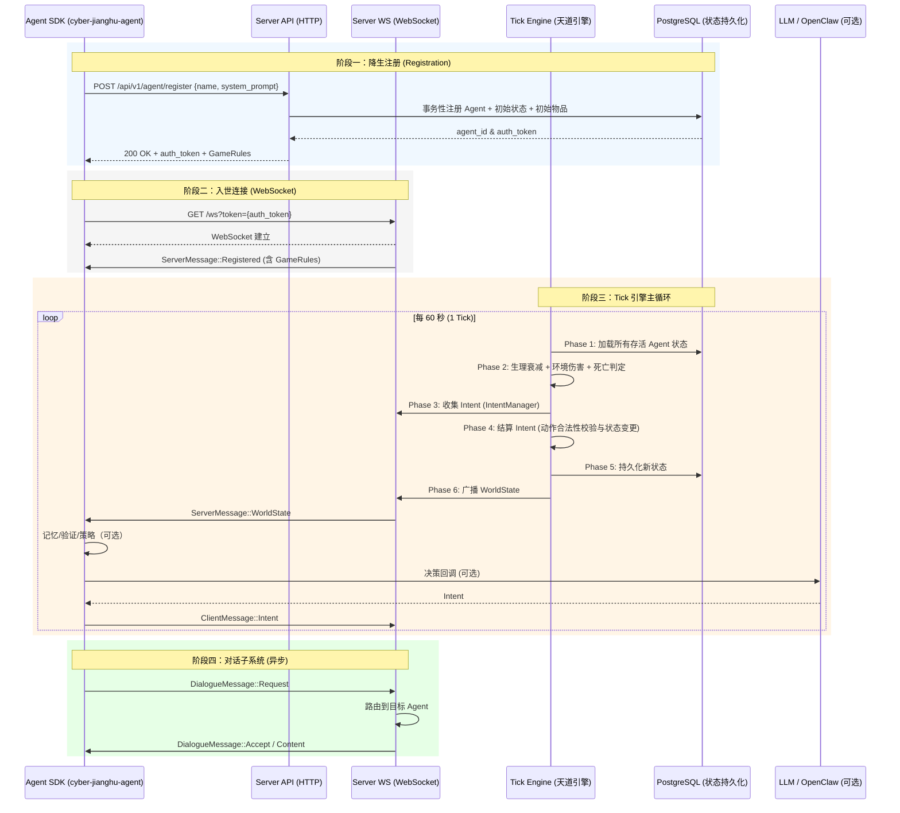

# Cyber-Jianghu MVP 交互逻辑图 (Interaction Logic)

本文档描述了 Cyber-Jianghu (赛博江湖) MVP 版本的核心交互逻辑，覆盖 Agent 的完整生命周期、天道引擎 (Tick Engine) 的运行阶段，以及 HTTP/WebSocket 双通道的实际交互方式。

## 1. 核心交互流程时序图

下图展示一个 Agent 从注册、连接、进入 Tick 循环，到对话子系统交互的完整流程。

## 2. 逻辑模块详解与代码映射

### 2.1 降生注册逻辑 (Registration)

- **触发点**: Server API [agent_register](./crates/server/src/handlers/agent.rs)
- **职责**:
  1. 校验 `name` 与 `system_prompt`。
  2. 事务性创建 Agent、初始状态和初始物品。
  3. 返回 `auth_token` 与 `GameRules`。

### 2.2 WebSocket 连接与注册确认

- **服务端**: [websocket_handler](./crates/server/src/websocket/handler.rs)
- **客户端**: [WebSocketClient::connect / wait_for_registration](./crates/agent/src/transport/websocket.rs)

连接后服务端下发 `ServerMessage::Registered`，客户端缓存 `GameRules` 与可选 `WorldBuildingRules`。

### 2.3 天道引擎 Tick 流转

Tick 引擎在 [TickScheduler::run](./crates/server/src/tick/scheduler.rs) 中驱动核心循环：

1. **加载状态**: 从数据库读取存活 Agent 最新状态。
2. **自然衰减**: 饥饿/口渴/体力衰减与环境伤害结算。
3. **收集意图**: 从 WebSocket IntentManager 收集全部 Intent。
4. **结算意图**: 通过动作执行器校验并应用状态变化，生成事件。
5. **持久化**: 写回新状态与事件。
6. **广播状态**: 下发 `WorldState` 给在线 Agent。

### 2.4 Agent 主循环 (SDK)

核心循环在 [Agent::run](./crates/agent/src/core/lifecycle.rs) 中：

1. **接收状态**: `receive_world_state()` 阻塞等待。
2. **记忆处理**: 可选地将事件写入工作记忆/情景记忆。
3. **验证与决策**: 若启用验证器，则先验证意图；否则调用决策回调。
4. **发送意图**: `send_intent()` 发送至服务端。
5. **容错**: 内置指数退避重连。

### 2.5 HTTP 模式（OpenClaw 等外部大脑）

HTTP 模式由 `cyber-jianghu-agent run --mode http` 启动，提供本地 API 供外部大脑调用：

- **HTTP Server**: [runtime/decision/http](./crates/agent/src/runtime/decision/http/mod.rs)
- **常用端点**:
  - `GET /api/v1/state`
  - `GET /api/v1/context`
  - `POST /api/v1/intent`
  - `POST /api/v1/validate`

OpenClaw 通过 HTTP API 提交 Intent，本地 Agent 再通过 WebSocket 上报服务端。

## 3. 数据驱动机制体现

- **动作系统**: 服务端从 `actions.json` 加载动作定义，通过 ActionRegistry 动态校验。
- **属性系统**: 通过 `attributes.json` + 公式引擎进行统一衍生属性计算。
- **世界观规则**: `world-building-rules.json` 可热更新并推送到客户端验证器。

## 4. 实际运行要点

- **Tick 周期**: 默认 60 秒（`TICK_DURATION_SECS`）。
- **Intent 时限**: 建议在当前 Tick 内完成决策与提交。
- **连接稳定性**: SDK 内置重连与心跳机制，无需额外实现。
