# Cyber-Jianghu 架构与数据流

**日期**: 2026-04-23
**版本**: v0.5

---

## 一、系统概览

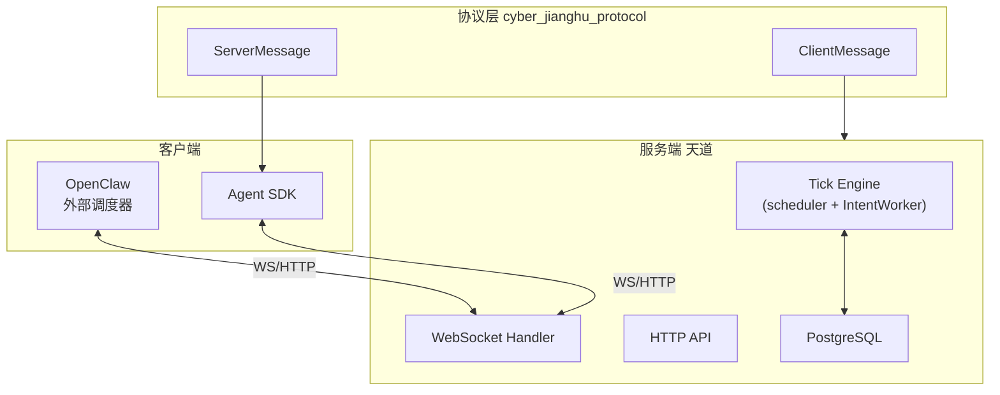

---

## 二、Server 内部架构

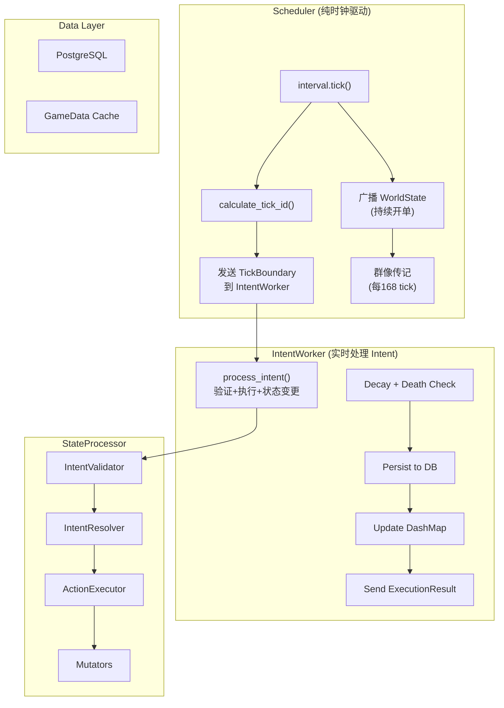

---

## 三、Agent 三魂架构

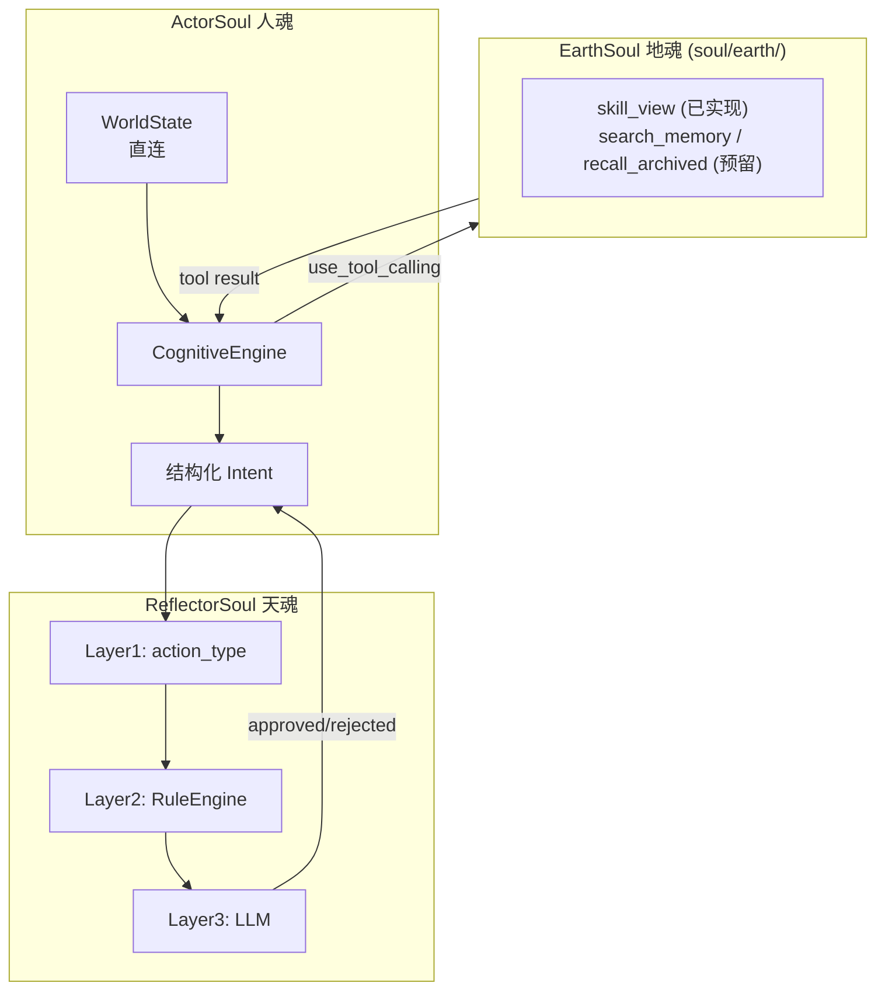

---

## 四、Tick 完整生命周期

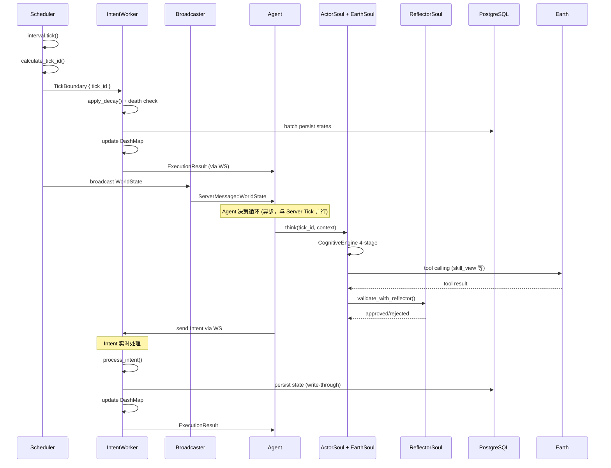

---

## 五、Intent 提交流程

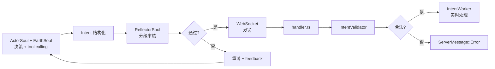

---

## 六、即时事件 (Speak) 流程

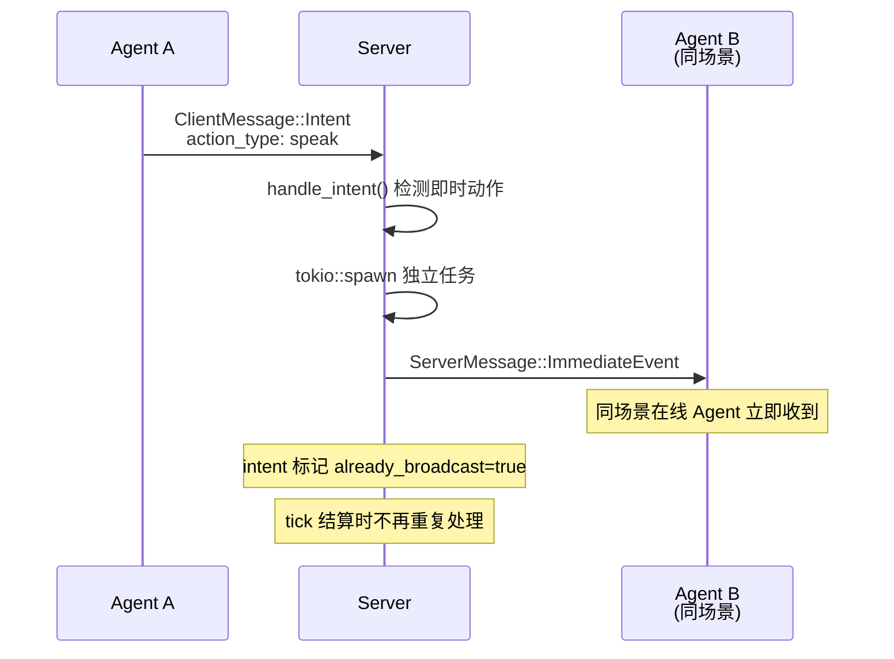

---

## 七、对话 (Whisper) 流程

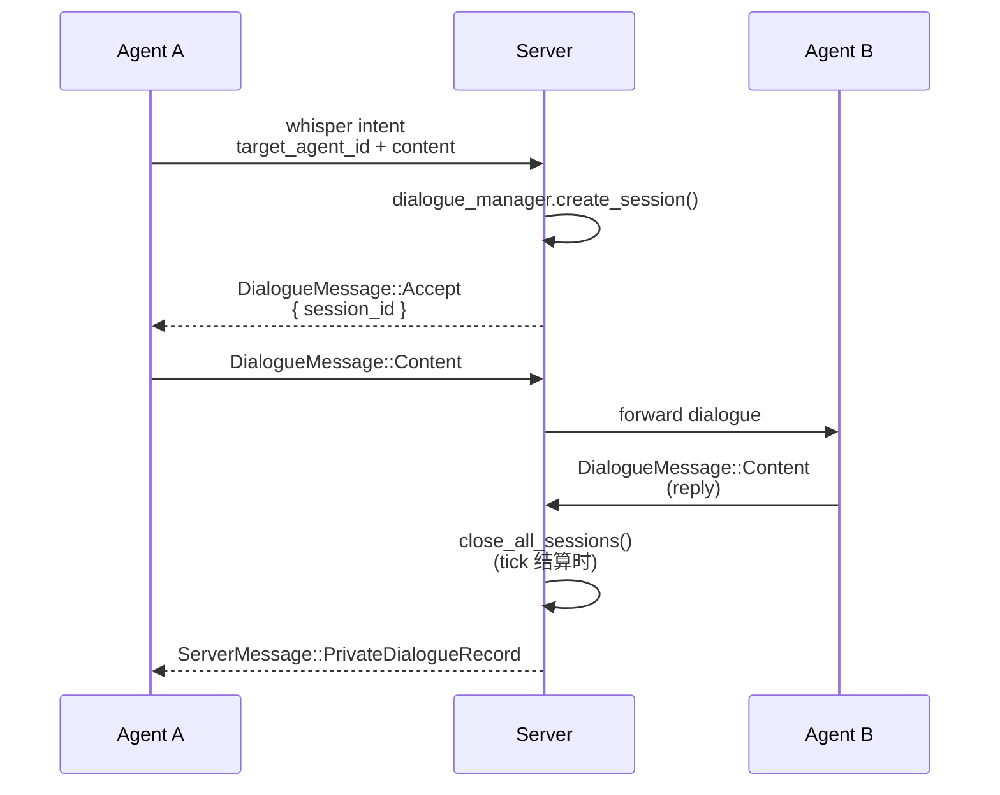

---

## 八、死亡通知流程

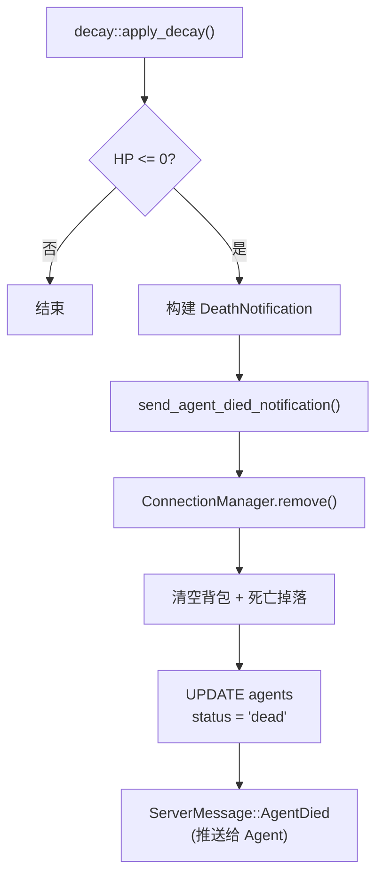

---

## 九、Agent 记忆系统

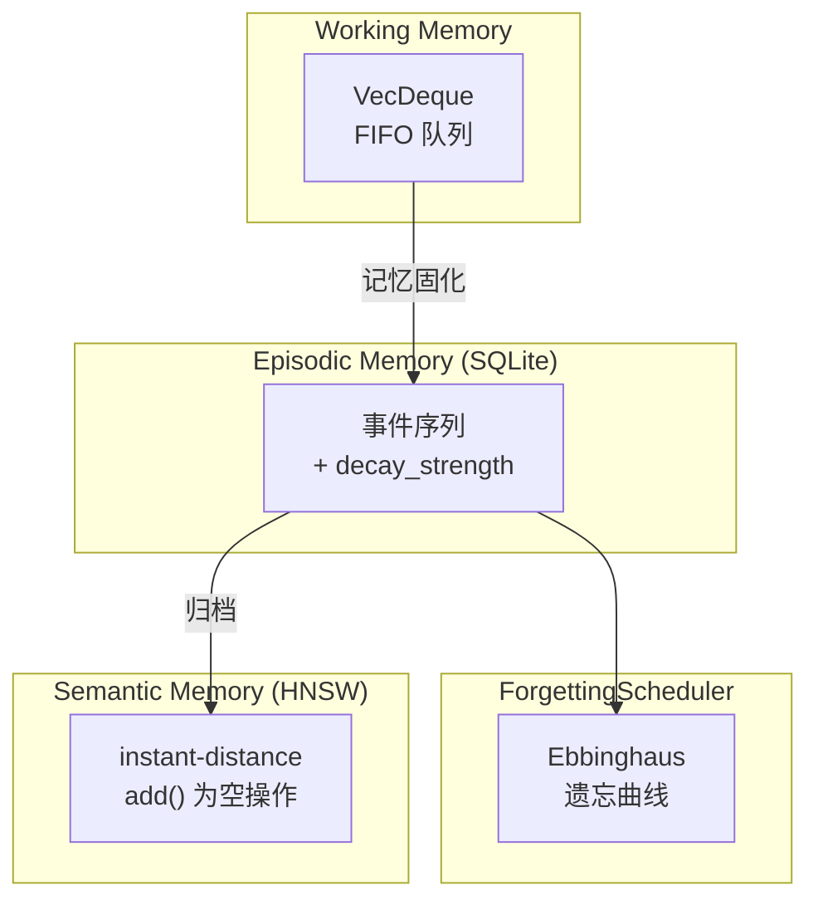

---

## 十、Server 模块依赖

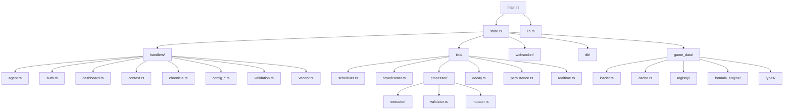

---

## 十一、Agent 模块依赖

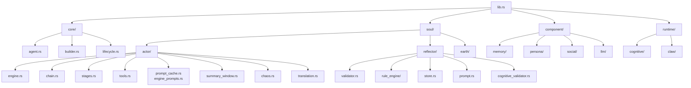

---

## 十二、数据库 Schema

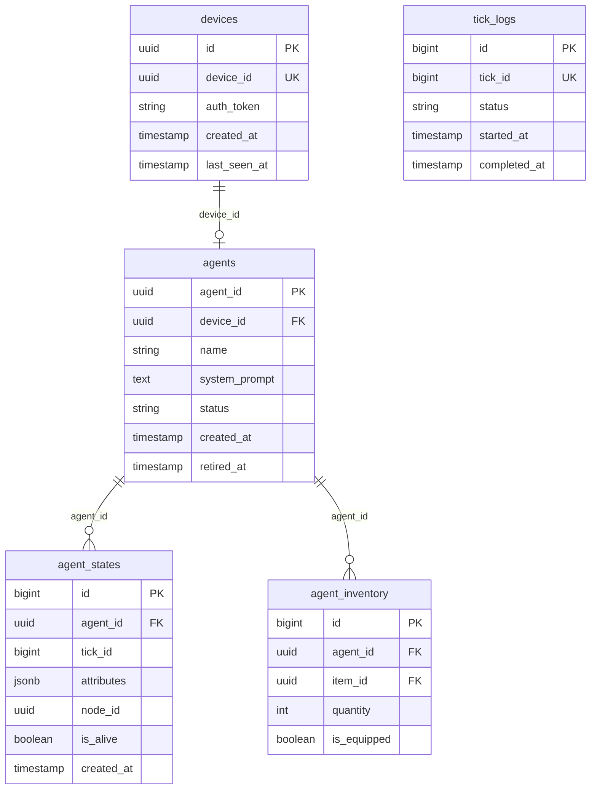

---

## 十三、配置热重载

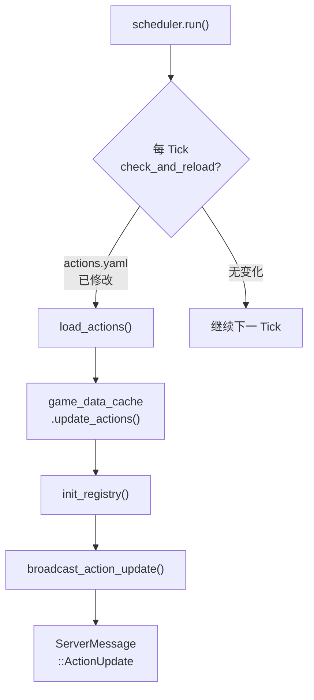

---

## 十四、地魂 Tool Calling 流程

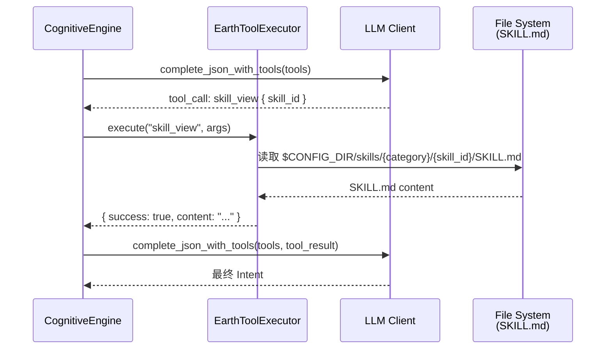

---

*文档生成时间: 2026-04-23*
